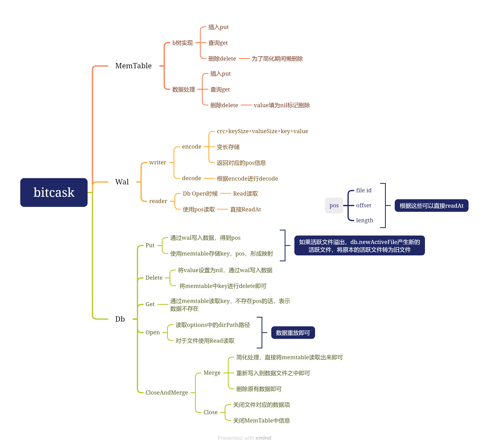

# 实现bitcask
## 大体思路
###  **MemTable**（内存表）
   - **Put**（插入）：插入数据
   - **Get**（查询）：查询数据
   - **Delete**（删除）：删除数据（为了简化删除操作，将 `value` 设为 `nil` 标记删除）

### **Wal**（预写日志）
   - **Writer**（写入器）
     - **Encode**：对数据进行编码（格式为 `crc+keySize+valueSize+key+value`），并返回对应的 `pos` 信息（包括 `file id`、`offset` 和 `length`）
   - **Reader**（读取器）
     - **Db Open 时**：读取数据，根据 `pos` 信息进行直接读取

### **Db**（数据库）
   - **Put**（插入）
     - 通过 `wal` 写入数据，得到 `pos`
     - 使用 `memtable` 存储 `key` 和 `pos` 的映射关系
   - **Delete**（删除）
     - 将 `value` 设为 `nil`，通过 `wal` 写入数据
     - 将 `memtable` 中的 `key` 进行删除
   - **Get**（查询）
     - 通过 `memtable` 读取数据，不存在则根据 `pos` 信息读取
   - **Open**（打开）
     - 读取 `Options` 中的 `dirPath` 路径
     - 对于文件使用 `Read` 读取
   - **CloseAndMerge**（关闭和合并）
     - **Merge**（合并）
       - 重新写入到新的数据文件中
       - 删除旧的数据文件
     - **Close**（关闭）
       - 关闭打开的数据项
       - 关闭 `MemTable` 中的信息
## 思维导图
